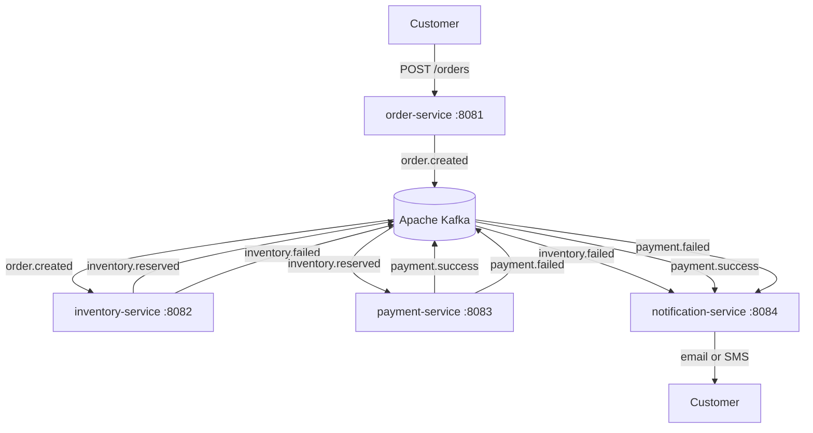

# Event-Driven Commerce Platform

A production-grade event-driven microservices platform built with Java, Spring Boot,
Apache Kafka, Docker, and Kubernetes. Services communicate asynchronously via Kafka
topics — enabling independent scaling, deployment, and failure isolation per service.

---

## Architecture


---

## Services

| Service              | Port | Responsibility                                              |
|----------------------|------|-------------------------------------------------------------|
| order-service        | 8081 | Accepts orders via REST API, publishes order.created event  |
| inventory-service    | 8082 | Reserves stock, publishes inventory.reserved or failed      |
| payment-service      | 8083 | Processes payment, publishes payment.success or failed      |
| notification-service | 8084 | Sends email or SMS based on final event outcome             |

---

## Kafka Topics

| Topic              | Producer             | Consumer             |
|--------------------|----------------------|----------------------|
| order.created      | order-service        | inventory-service    |
| inventory.reserved | inventory-service    | payment-service      |
| inventory.failed   | inventory-service    | notification-service |
| payment.success    | payment-service      | notification-service |
| payment.failed     | payment-service      | notification-service |
| *.dlq              | any service          | ops / monitoring     |

---

## Event Flow
```
1. Customer sends POST /orders to order-service
2. order-service saves order to DB → publishes order.created to Kafka
3. inventory-service consumes order.created → checks stock
   - Stock available  → publishes inventory.reserved
   - Stock not found  → publishes inventory.failed
4. payment-service consumes inventory.reserved → charges customer
   - Payment success  → publishes payment.success
   - Payment fails    → publishes payment.failed
5. notification-service consumes final event → sends email or SMS
6. Any failure after 4 retries → routed to Dead Letter Queue (*.dlq)
```

---

## Tech Stack

| Tool         | Version | Purpose                        |
|--------------|---------|--------------------------------|
| Java         | 17      | Primary language               |
| Spring Boot  | 3.2     | Microservice framework         |
| Apache Kafka | 3.6     | Async event streaming          |
| Docker       | 24+     | Containerization               |
| Kubernetes   | 1.28+   | Container orchestration        |
| Helm         | 3+      | Kubernetes package manager     |
| Prometheus   | 2.x     | Metrics collection             |
| Grafana      | 10.x    | Monitoring dashboards          |
| PostgreSQL   | 15+     | Per-service database           |

---

## Getting Started

### Prerequisites
- Java 17+
- Docker Desktop
- Git

### Clone the repo
```bash
git clone git@github.com:jaswanthigolla-source/event-driven-commerce-platform.git
cd event-driven-commerce-platform
```

### Run locally with Docker Compose (coming soon)
```bash
docker-compose up
```

---

## Project Structure
```
event-driven-commerce-platform/
├── order-service/          # REST API + Kafka producer
├── inventory-service/      # Kafka consumer + stock logic
├── payment-service/        # Kafka consumer + payment logic
├── notification-service/   # Kafka consumer + email/SMS
├── docker/                 # Dockerfiles and compose files
├── k8s/                    # Kubernetes manifests
├── docs/                   # Architecture and design docs
└── learning-notes.md       # Engineering decisions and learnings
```

---

## Roadmap

- [x] Project structure and architecture design
- [ ] order-service — REST API and Kafka producer
- [ ] inventory-service — Kafka consumer and stock reservation
- [ ] payment-service — Kafka consumer and payment processing
- [ ] notification-service — email and SMS on events
- [ ] Docker Compose for local development
- [ ] Kubernetes manifests for all services
- [ ] Prometheus and Grafana observability stack
- [ ] GitHub Actions CI/CD pipeline

---

## Key Engineering Decisions

**Why Kafka over REST between services?**
Kafka decouples producers and consumers completely. If inventory-service goes down,
orders keep flowing into Kafka and are processed when it recovers. REST calls would fail immediately.

**Why Dead Letter Queues?**
After 4 retry attempts with exponential backoff, failed events move to a DLQ topic.
This prevents poison messages from blocking the consumer and allows manual replay after fixes.

**Why idempotency keys?**
Kafka guarantees at-least-once delivery — the same event can arrive more than once.
Each service stores processed eventIds to detect and skip duplicates safely.

---

## Learning Notes

See [learning-notes.md](./learning-notes.md) for daily engineering decisions,
challenges encountered, and lessons learned while building this system.