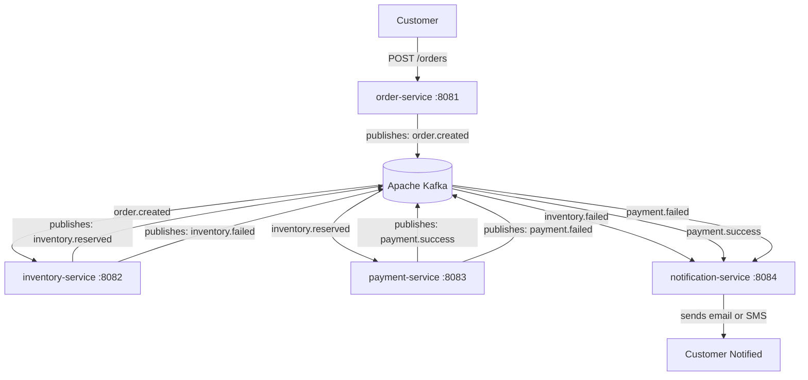

# System Architecture — Event-Driven Commerce Platform

## Overview

This platform uses event-driven architecture where services communicate
via Apache Kafka topics instead of direct REST calls.
Each service is independently deployable, scalable, and failure-isolated.

---

## Services and Responsibilities

| Service              | Port | Responsibility                                             |
|----------------------|------|------------------------------------------------------------|
| order-service        | 8081 | Accepts REST orders, validates, persists, publishes events |
| inventory-service    | 8082 | Reserves stock based on order events                       |
| payment-service      | 8083 | Processes payments after inventory is confirmed            |
| notification-service | 8084 | Sends email or SMS on success or failure                   |

---

## Kafka Topics

| Topic              | Producer             | Consumer             |
|--------------------|----------------------|----------------------|
| order.created      | order-service        | inventory-service    |
| inventory.reserved | inventory-service    | payment-service      |
| inventory.failed   | inventory-service    | notification-service |
| payment.success    | payment-service      | notification-service |
| payment.failed     | payment-service      | notification-service |
| order.dlq          | order-service        | ops/monitoring       |
| inventory.dlq      | inventory-service    | ops/monitoring       |
| payment.dlq        | payment-service      | ops/monitoring       |

---

## Event Flow


---

## Retry Strategy

Each service retries failed event processing using exponential backoff:
```
Attempt 1  ->  process immediately
Attempt 2  ->  wait 2 seconds
Attempt 3  ->  wait 4 seconds
Attempt 4  ->  wait 8 seconds
After 4 failures  ->  send to Dead Letter Queue (DLQ)
```

---

## Dead Letter Queue (DLQ) Handling

- Every Kafka topic has a paired DLQ topic
- Example: order.created fails -> moves to order.dlq
- After max retries are exhausted, the failed message moves to the DLQ
- A monitoring consumer reads DLQ topics and alerts the operations team
- Failed messages can be replayed manually after the root cause is fixed

---

## Idempotency Approach

**Problem:** Kafka can deliver the same event more than once.

**Solution:** Each event carries a unique eventId (UUID).
Each service stores processed eventIds in a database table.
Before processing, the service checks if the eventId already exists.

- If yes -> skip processing (duplicate detected)
- If no  -> process the event and save the eventId

**Event structure:**
```json
{
  "eventId": "550e8400-e29b-41d4-a716-446655440000",
  "orderId": "order-999",
  "timestamp": "2026-03-14T10:00:00Z",
  "payload": {}
}
```

**Database table to track processed events:**
```sql
CREATE TABLE processed_events (
    event_id     VARCHAR(255) PRIMARY KEY,
    processed_at TIMESTAMP DEFAULT NOW()
);
```

---

## Infrastructure Overview
```mermaid
flowchart LR
    subgraph Services
        A[order-service]
        B[inventory-service]
        C[payment-service]
        D[notification-service]
    end

    subgraph Messaging
        K[(Apache Kafka)]
    end

    subgraph Observability
        P[Prometheus]
        G[Grafana]
    end

    subgraph Database
        DB[(PostgreSQL\nper service)]
    end

    Services  K
    Services --> DB
    Services --> P
    P --> G
```